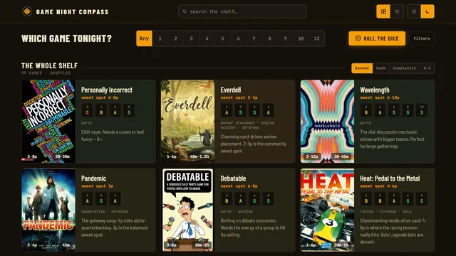

# GameNight



A tiered guide to a board game shelf, rated by how each game plays at every player count instead
of one star rating averaged across all of them.

Mine runs at https://gamenight.yaqzan.dev.

Game night always stalled on the same question: given who showed up, what do we play. A game that
shines at two players can be miserable at five, and a box's own rating never says so. GameNight
answers "what's good tonight" in five seconds by tiering S through F per player count, with a
teach-time filter and vibe tags for nights when the question is "something light."

## Quick start

You need Python 3.11+ and Node 18+.

```bash
git clone https://github.com/yaqzan/gamenight
cd gamenight/frontend
npm install
npm run build
cd ..
python -m gamenight serve        # http://127.0.0.1:5004
```

That builds and serves a 10-game example shelf. `npm run dev` inside `frontend/` gives you hot
reload instead.

## Your data

Your shelf lives in `data/games.json`, which is gitignored, so pulling updates never touches it.

```bash
python -m gamenight init          # copies the example shelf into data/games.json
python -m gamenight init --empty  # or start from nothing
python -m gamenight validate      # schema-check it
```

Until `data/games.json` exists, everything reads `examples/games.json`. Each entry is one game:

```json
{
  "name": "Patchwork",
  "learn": "A",
  "pc": { "2": "S" },
  "vibes": ["Duel", "Puzzle"],
  "sweet": "2p",
  "note": "One or two sentences on how it actually plays."
}
```

`pc` maps player count to tier, and `learn` is how long the teach takes (S is instant, F is a very
heavy rulebook). Tiers are relative to your own shelf: S at 3p means one of the best things your
collection does with three players. The full rubric is in `.claude/docs/rating-rubric.md`, and
`gamenight/schema.py` holds the vibe vocabulary. After editing the file, rebuild with
`npm run build` and the running server picks it up with no restart.

Other local-only files, all gitignored:

| file | what it's for |
|---|---|
| `frontend/.env.local` | `VITE_SITE_URL=https://your.domain` adds your URL to the footer and og:url |
| `ops/cloudflared-config.yml` | your tunnel, copied from `ops/cloudflared-config.example.yml` |
| `.research/` | research runs and the backup taken before every write to games.json |
| `frontend/public/images/` | local copies of box art |

## Adding games with research

`python -m gamenight research "Name"` dispatches a [Claude Code](https://claude.com/claude-code)
subagent against the rating rubric and a live digest of your current shelf, so a new entry gets
judged relative to what you already own. It needs the `claude` CLI on your PATH. It's dry-run by
default; `--apply` backs up games.json, merges the entry, and rebuilds. An existing entry is never
replaced without `--force`.

Box art, BGG links, and playtime come from one BoardGameGeek API lookup. That needs a free
non-commercial token from https://boardgamegeek.com/applications in a `BGG_API_TOKEN` environment
variable. Without it, research still works and entries just have no art.

```bash
python -m gamenight images --apply     # backfill box art on existing entries
python -m gamenight playtime --apply   # backfill per-count playtime
```

## Hosting

The server binds to 127.0.0.1 only and serves the built SPA plus `/api/health`. Hashed
`/assets/*` files get immutable cache headers and everything else is no-cache, so a build goes
live the moment it finishes. To put it on the internet I run a Cloudflare tunnel in front of it
(`ops/cloudflared-config.example.yml`).

On Windows, `ops/windows/install-tasks.ps1` registers a 5-minute watchdog task that restarts the
server and tunnel if they're down. Pass `-Controller <script>` if you already have your own
service manager and want the watchdog to call it instead.

## Layout

```
examples/games.json   the example shelf
data/games.json       your shelf (gitignored)
gamenight/            Python: serve, init, research, images, playtime, validate
frontend/             Vite + React + TypeScript SPA
tests/                python -m unittest
ops/                  tunnel config example, Windows watchdog
design/               design canvas sources
```

`.claude/` holds the guidance I give Claude Code when it works in this repo. I develop with agents
heavily, and the docs there are the project's memory.

## License

MIT
